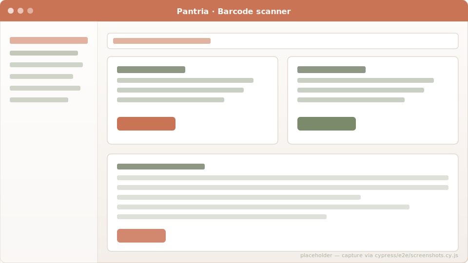

# Barcode scanning

Pantria has multiple barcode entry points, all sharing the same
two-decoder strategy:

1. **Native `BarcodeDetector` API** (Chrome / Edge / Android Chrome) —
   zero JS overhead, GPU-accelerated.
2. **ZXing-js fallback** (`@zxing/browser`, vendored under
   `vendor/javascript/`) for Safari iOS / Firefox / anything missing
   `BarcodeDetector`. Served from same origin so the PWA can cache it.

## Three places to scan from

| Location                            | What scanning does                                                                                                            |
| ----------------------------------- | ----------------------------------------------------------------------------------------------------------------------------- |
| `/products/scan`                    | Lookup-first. Shows the matched product + quick actions (add to storage, mark purchased), or fallback (create / attach).      |
| `/storage_items/scan`               | **Kiosk mode**: camera stays on, every detection auto-adds qty 1 to storage. Manual entry fallback below.                     |
| Product show page → "📷 Scan"        | Adds a brand-variant barcode to an existing product without typing it.                                                        |
| Grocery list                        | `POST /grocery_items/scan_purchase` — flip a needed row to purchased + create the storage entry in one step.                  |

## Lookup waterfall

When you scan a barcode on `/products/scan`, the resolver tries (in order):

1. **Household match** via `Product.by_barcode(code)` — checks the
   primary `barcode` column AND every `ProductBarcode` alternate row.
2. **External barcode services** — Open Food Facts, then Open Products
   Facts, then Marktguru's `searchByEan` endpoint. The first hit returns
   a `BarcodeLookup::Result` with name / brand / quantity_text / image_url.
3. **Manual fallback** — "Create a product for this code" button opens
   the new-product form pre-filled with the code.

The waterfall is implemented in [`app/services/barcode_lookup.rb`](https://github.com/SGraef/Pantria/blob/main/app/services/barcode_lookup.rb)
with per-source adapter classes under `barcode_lookup/`.

## Attach an alternate EAN

Same product can be sold under multiple brands / EAN ranges
(Eigenmarken, regional variants). On the product show page, the
"📷 Scan" button opens an inline camera viewport. The detected EAN
drops into the existing "Add barcode" form's input field — you fill in
the brand / variant text and submit normally. The Stimulus controller
is `scan_to_input_controller.js`.

## HTTPS requirement

`getUserMedia` is restricted to secure contexts. On `http://` (other
than `localhost`) the browser silently denies the camera. The scanner
controllers detect this and show a guidance message:

> Kamera nicht verfügbar — die Seite muss über HTTPS aufgerufen werden
> (oder direkt vom Host-Rechner). Manuelle Eingabe unten verwenden.

To use the camera from a phone on your LAN, run the dev server with the
bundled self-signed HTTPS override (see the README's
"Self-signed HTTPS for mobile scanning" section).

## iOS PWA caveat

Before iOS 16.4 (March 2023), installed home-screen PWAs on iOS had no
camera access at all — only Safari proper. 16.4+ opened it up, so
anything current works. Android Chrome has always supported it inside
PWAs.

## Code references

- Frontend (Stimulus): [`app/javascript/controllers/barcode_scanner_controller.js`](https://github.com/SGraef/Pantria/blob/main/app/javascript/controllers/barcode_scanner_controller.js)
- Kiosk variant: [`app/javascript/controllers/storage_kiosk_controller.js`](https://github.com/SGraef/Pantria/blob/main/app/javascript/controllers/storage_kiosk_controller.js)
- Lookup service: [`app/services/barcode_lookup.rb`](https://github.com/SGraef/Pantria/blob/main/app/services/barcode_lookup.rb)
- Vendored ZXing: [`vendor/javascript/@zxing--browser.js`](https://github.com/SGraef/Pantria/blob/main/vendor/javascript/@zxing--browser.js)
