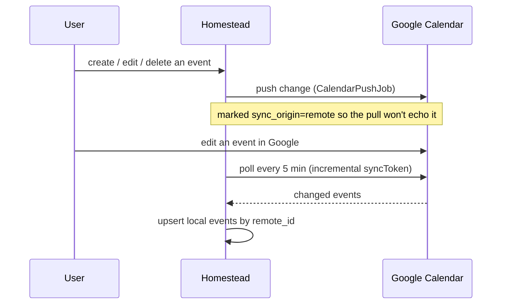

# Calendar sync (Google)

Homestead's [calendar](calendar.md) can two-way-sync with **Google Calendar**:
events you create in Homestead appear in Google, and changes in Google flow back
into Homestead. There is **one connection per instance**, configured through the
UI by an admin — Homestead serves a single household, so a single shared calendar
matches the deployment model.

!!! note "You provide your own Google OAuth client"
    Homestead is self-hosted, so there is no shared Homestead Google app. You create
    a Google Cloud project and OAuth client once and paste the ID + secret into
    **Calendar → Calendar sync**. Step-by-step:
    [Google Calendar OAuth setup](../google-calendar-oauth-setup.md).

## Connecting

Open **Calendar → Calendar sync** (`/calendar_connection`, admin-only):

1. Paste your Google OAuth **client ID** and **client secret**. The page shows
   the exact redirect URI to register in Google
   (`…/calendar_connection/callback`).
2. **Connect** redirects you to Google's consent screen; Google redirects back
   to the callback, which stores the access + refresh tokens.
3. **Select a calendar** — choose which of your Google calendars Homestead should
   sync with.

OAuth tokens and the client secret are stored encrypted at rest.

## How the two-way sync works

- **Homestead → Google.** Creating, updating or deleting a local event enqueues a
  `CalendarPushJob` that writes the change to Google.
- **Google → Homestead.** A recurring job polls Google every 5 minutes using an
  incremental `syncToken` (and you can trigger a pull immediately with **Sync
  now**). Remote events are matched to local rows by `remote_id`; new ones are
  created, changed ones updated.
- **Loop prevention.** Each event tracks its `sync_origin`, `remote_id` and
  `etag`. A change that arrived from Google is not pushed straight back, and a
  change Homestead pushed is not re-imported — mirroring the same echo-guard
  approach used for Bring! grocery sync.

The poll is a no-op unless a calendar is connected, so it costs nothing on
instances that don't use sync. Connection health (last sync time, last error)
is shown on the settings page.

## Code references

- Model: [`app/models/calendar_connection.rb`](https://github.com/SGraef/Homestead/blob/main/app/models/calendar_connection.rb)
- Controller: [`app/controllers/calendar_connections_controller.rb`](https://github.com/SGraef/Homestead/blob/main/app/controllers/calendar_connections_controller.rb)
- Sync services: [`app/services/calendar_sync/`](https://github.com/SGraef/Homestead/tree/main/app/services/calendar_sync)
- Jobs: [`app/jobs/calendar_poll_job.rb`](https://github.com/SGraef/Homestead/blob/main/app/jobs/calendar_poll_job.rb),
  [`app/jobs/calendar_push_job.rb`](https://github.com/SGraef/Homestead/blob/main/app/jobs/calendar_push_job.rb)
