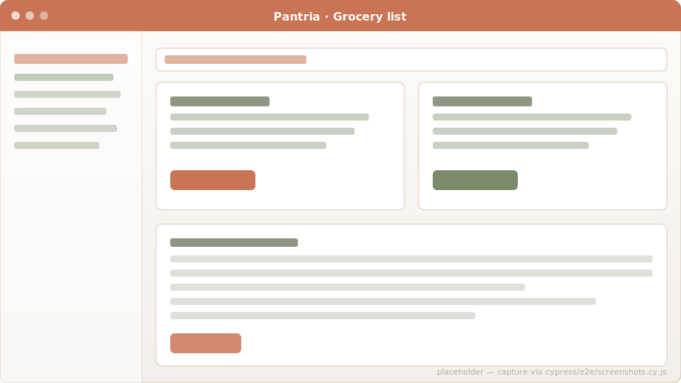
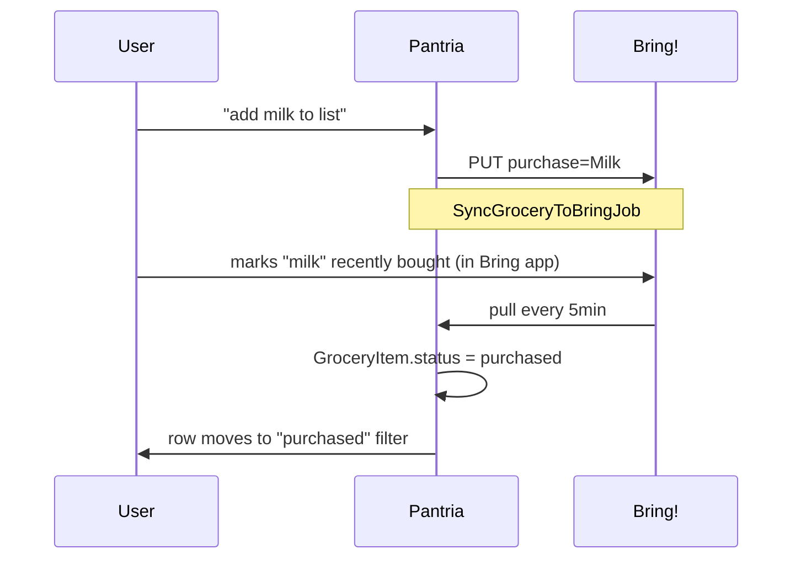
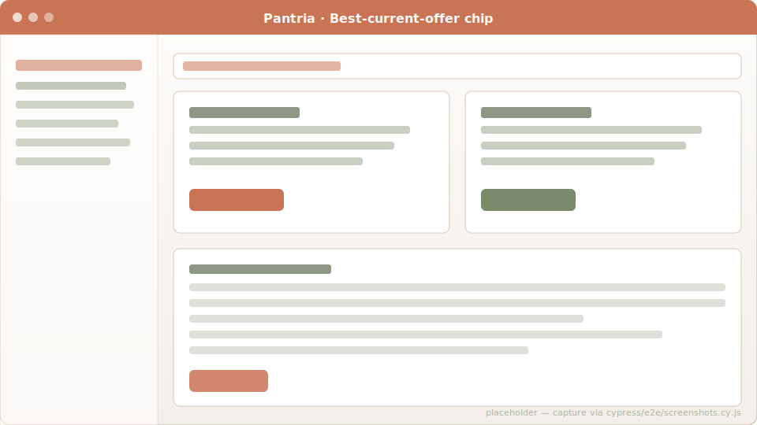

# Grocery list

The household's shared shopping list. Two flavours of row:

- **Freeform**: just type "Avocados, 2 ripe" and submit. No Product gets
  materialised. Lightweight scribble-it-down mode.
- **Linked to a Product**: unlocks offer matching, auto-add-to-storage
  on purchase, and Bring! sync round-trip with the canonical name.

## Two-way Bring! sync

`/bring_connection` walks you through linking a Bring! account. Once
connected:

- **Pantria → Bring**: every write on a grocery row (create, update,
  destroy) enqueues a `SyncGroceryToBringJob` that pushes or removes
  the item from your Bring list.
- **Bring → Pantria**: a recurring Solid Queue job pulls Bring's list
  state every 5 minutes (or via the manual "Sync now" button).
  Bring items that match a household Product (by name OR by registered
  synonym, via `Product.match_by_term`) link to it; everything else
  creates a freeform row. The pull is wrapped in
  `GroceryItem.without_bring_sync` so the after-commit callbacks don't
  echo the change right back to Bring.

## Mark purchased by scanning

`POST /grocery_items/scan_purchase` (or the camera button on the list)
takes a barcode, resolves it via `Product.by_barcode`, and flips the
matching "needed" row to "purchased". With a Product linked, that
purchase also creates a StorageItem in the household's default location
— so the same scan moves the row off the list AND into the pantry.

## Best-current-offer chip

When a grocery row is linked to a Product *and* there's an active
Offer for that product in the household's allow-listed retailers, the
row shows a green chip like `1,29 € @ ALDI Nord`. Clicking it deep-links
to the offer.

Lookup is one query per page load via `best_offers_for(@items)` —
picks the cheapest current offer per `product_id` with ties broken by
earliest `valid_until`.

## Filter + purge

- Default view shows `status = needed` only.
- "Show all" toggle reveals purchased rows so you can spot mis-clicks.
- "Remove purchased (N)" bulk-destroys every purchased row in one
  transaction.

## Code references

- Model: [`app/models/grocery_item.rb`](https://github.com/SGraef/Pantria/blob/main/app/models/grocery_item.rb)
- Bring pull: [`app/services/bring/pull.rb`](https://github.com/SGraef/Pantria/blob/main/app/services/bring/pull.rb)
- Bring push job: [`app/jobs/sync_grocery_to_bring_job.rb`](https://github.com/SGraef/Pantria/blob/main/app/jobs/sync_grocery_to_bring_job.rb)
