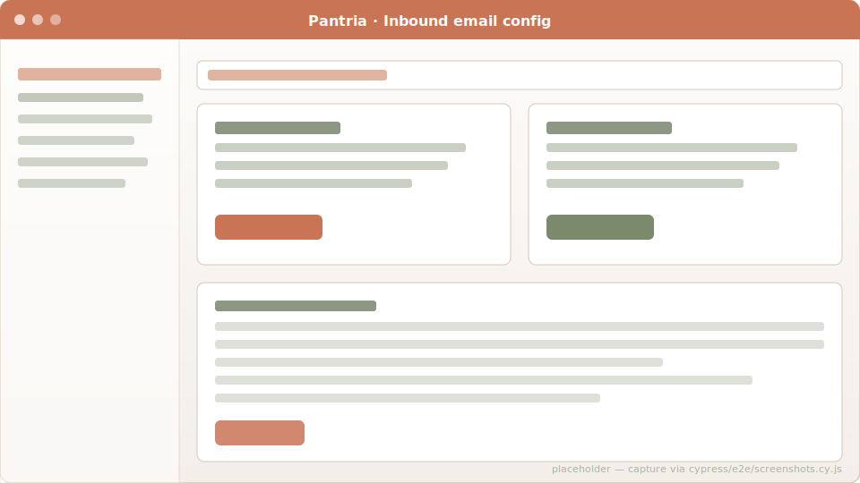

# Inbound email

Many German supermarkets email you an e-receipt PDF when you check out
with a customer card. Pantria can poll those mailboxes and turn the
attachments into pending Receipts automatically.

## Configuration

`/households/inbound_emails` — every household member can add one or
more IMAP sources. Per source:

- **Label** — display name only.
- **IMAP host / port / SSL** — typical: `imap.gmail.com` / `993` / on.
- **Username + password** — password stored encrypted at rest via
  `Rails encrypts :imap_password` (key derived from `SECRET_KEY_BASE`).
- **Folder** — default `INBOX`. Sub-folders work: `INBOX/Receipts`.
- **Drain only flag** — when set, also moves processed emails to a
  configurable target folder (so the inbox doesn't fill up).
- **Optional sender filter** — only ingest mails from these addresses.



## Polling

A `PollInboundReceiptsJob` runs every 5 minutes (via Solid Queue's
recurring scheduler). For each enabled source it:

1. Connects via Net::IMAP.
2. Selects the configured folder.
3. Searches for unseen messages matching the source's filter.
4. For each hit: extracts the message body + every attachment whose
   MIME type is in `SUPPORTED_TYPES` (PDF / JPEG / PNG / HEIC).
5. Per attachment: creates a `Receipt` row, attaches the file via
   Active Storage, marks the message as seen, enqueues a
   `ProcessReceiptJob`.
6. Optionally moves the message to the configured target folder.

Errors are caught per-source and stamped onto the
`InboundEmailSource#last_error` column so the UI can surface a "broken
mailbox" warning without taking the others down.

## Triggering on demand

The poller is exposed as a Bearer-token-authed API endpoint, intended
for n8n / Home Assistant / cron / whatever:

```bash
# Drain every source the calling user owns
curl -X POST https://pantria.your-domain.tld/api/v1/inbound_emails/poll \
     -H "Authorization: Bearer $TOKEN"

# Drain one specific source
curl -X POST https://pantria.your-domain.tld/api/v1/inbound_emails/123/poll \
     -H "Authorization: Bearer $TOKEN"

# List sources + their health
curl https://pantria.your-domain.tld/api/v1/inbound_emails \
     -H "Authorization: Bearer $TOKEN"
```

The response is a small JSON status report (number of new receipts,
per-source error message if any). Generate the token from your account
page once and stash it in your automation tool's secret store.

## Code references

- Source model: [`app/models/inbound_email_source.rb`](https://github.com/SGraef/Pantria/blob/main/app/models/inbound_email_source.rb)
- IMAP poller: [`app/services/inbound_receipts/imap_poller.rb`](https://github.com/SGraef/Pantria/blob/main/app/services/inbound_receipts/imap_poller.rb)
- API: [`app/controllers/api/v1/inbound_emails_controller.rb`](https://github.com/SGraef/Pantria/blob/main/app/controllers/api/v1/inbound_emails_controller.rb)
