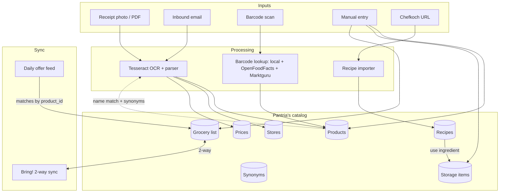

# Features

A guided tour of what Pantria can do. Each page links to the code so you can
see exactly what's happening behind the screenshot.

-   :material-package-variant-closed: **[Storage](storage.md)** —
    pantry, fridge, freezer, custom locations. Expiry warnings. "Used N"
    decrement + freeform amount. Scan-to-add kiosk for bulk unloading.

-   :material-cart: **[Grocery list](grocery-list.md)** —
    freeform shopping items OR linked to tracked products. Bring! two-way
    sync. Mark-purchased-by-barcode at the till.

-   :material-barcode-scan: **[Barcode scanning](barcode-scanning.md)** —
    native `BarcodeDetector` with ZXing fallback. Lookup falls back to
    Open Food Facts / Open Products Facts / Marktguru. Attach EANs to
    existing products by scanning.

-   :material-receipt-text-outline: **[Receipt OCR](receipts.md)** —
    upload JPEG/PNG/HEIC/PDF, Tesseract + heuristic parser extracts
    store, date, total and line items. Per-line confirmation UI with
    editable amount.

-   :material-chef-hat: **[Recipes & meal plan](recipes.md)** —
    Chefkoch URL import, "used" button per ingredient decrements
    storage, "add missing to grocery list" bulk action. Weekly meal-plan
    suggester with soft DGE health guidelines and 4-week cooldown.

-   :material-tag-multiple-outline: **[Offers](offers.md)** —
    daily sync from Marktguru, kaufDA, MeinProspekt, Flaschenpost.
    Per-household allow-list, keyword-based categorisation, watchlist.

-   :material-checkbox-marked-outline: **[Todos](todos.md)** —
    shared task list with three states, member assignment, follow,
    comments, an in-app notification bell and PWA Web Push.

-   :material-calendar-month: **[Calendar](calendar.md)** —
    server-rendered month/agenda/day views, todo due-date projection,
    and German date-detection that suggests events from comments.

-   :material-calendar-sync: **[Calendar sync](calendar-sync.md)** —
    two-way Google Calendar sync, one connection per instance, set up
    through the UI with your own OAuth client.

-   :material-email-outline: **[Inbound email](inbound-email.md)** —
    IMAP poller pulls receipt attachments from configured mailboxes.
    Trigger on-demand via `POST /api/v1/inbound_emails/poll`.

## How the pieces fit together

