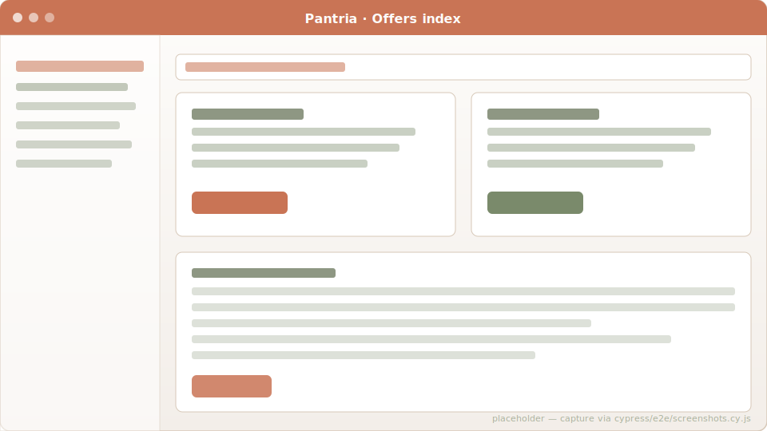
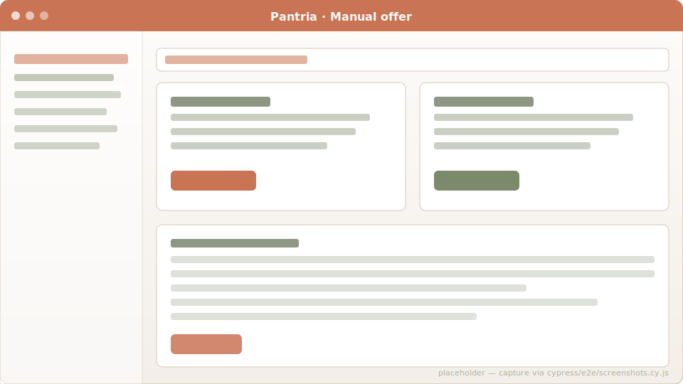

# Offers

Daily sync of current grocery promotional offers from German retailers,
matched against your tracked products. The grocery list shows a "best
current offer" chip per linked-product row so you know what's cheap
this week.

## Sources

Homestead ships four adapters under `app/services/`:

| Source           | Coverage              | Notes                                                              |
| ---------------- | --------------------- | ------------------------------------------------------------------ |
| **Marktguru**    | Most chains by zip    | API-based. Default for all postal codes.                           |
| **kaufDA**       | ALDI Nord (default)   | Scrapes `kaufda.de/Geschaefte/<RetailerSlug>`. Override via `KAUFDA_RETAILERS`. |
| **MeinProspekt** | Regional flyers       | Scrapes the public sitemap + per-store JSON.                       |
| **Flaschenpost** | Beverage delivery     | Per-household warehouse_id (`Household.flaschenpost_warehouse_id`). |

Each adapter yields a uniform `OfferData` struct so `OfferSyncer` can
treat them interchangeably.

## Sync schedule

A `SyncAllOffersJob` recurring task in Solid Queue fires once per day
and fans out a `SyncOffersJob` per household with a `postal_code` set.
Each per-household job pulls every enabled source, dedupes by
`external_id`, and upserts Offer rows. The "Sync now" button on
`/offers` triggers the same fan-out on demand.

## Per-household configuration

- **Postal code** (`Household#postal_code`) — required for Marktguru +
  MeinProspekt. Without it the household skips those sources.
- **Retailer allow-list** (`OfferRetailerFilter`) — only offers from
  these retailers reach the household. Empty = all.
- **Blocklist** (`OfferBlocklistEntry`) — keyword-based, kills specific
  offers ("Hundefutter", "Zigaretten").
- **Watchlist** (`OfferWatchlistEntry`) — highlights matching offers
  inline so you don't miss the thing you actually want.
- **Categories** (`OfferCategory` + `OfferCategoryKeyword`) — per-household
  taxonomy that the `OfferCategorizer` uses to bucket incoming offers.

## Matching back to your data

Offers join to Products via name + brand fuzzy match (see
`OfferProductMatcher`). When a match exists, two things happen:

- The grocery list shows the **best current offer** chip for that
  product row, deep-linking back to `/offers#offer-<id>` so a tap
  surfaces the full details.
- The "Add to grocery list" button on an offer row creates / bumps a
  needed `GroceryItem` linked to the matched product.

## Manual offers

Found a paper flyer Marktguru doesn't cover? `/manual_offers/new` lets
you enter one by hand. They flow into the same offer pipeline (same
indexes, same matching, same expiry chip).

## Code references

- Syncer: [`app/services/offer_syncer.rb`](https://github.com/SGraef/Homestead/blob/main/app/services/offer_syncer.rb)
- Marktguru adapter: [`app/services/marktguru/offers.rb`](https://github.com/SGraef/Homestead/blob/main/app/services/marktguru/offers.rb)
- kaufDA adapter: [`app/services/kaufda/offers.rb`](https://github.com/SGraef/Homestead/blob/main/app/services/kaufda/offers.rb)
- Categorizer: [`app/services/offer_categorizer.rb`](https://github.com/SGraef/Homestead/blob/main/app/services/offer_categorizer.rb)
