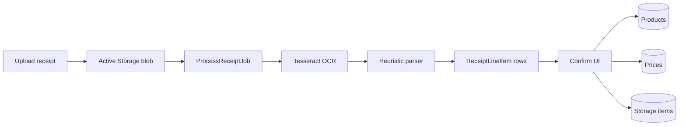
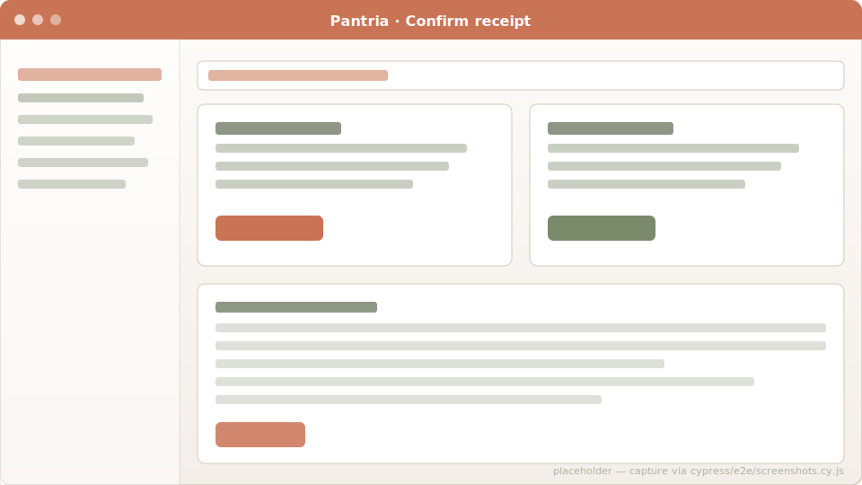

# Receipt OCR

Upload a photo of a paper receipt — or a PDF e-receipt — and Pantria
turns it into a Store, a set of Products, a set of Prices, and
(optionally) StorageItems for everything you just bought.

## Upload

`POST /receipts` with a `receipt[image]` file from the web form, or
`POST /api/v1/receipts` with a Bearer token for automation. The image
is attached via Active Storage and a `ProcessReceiptJob` enqueues on
the `receipts` queue. That queue runs on its own Solid Queue worker
pool with `OMP_THREAD_LIMIT=2` so a single OCR pass can't pin every
core on a small box.

## OCR pipeline

`ReceiptScanner.call(image_path)`:

1. **Photo preprocessing** (ImageMagick): auto-orient (EXIF), grayscale,
   contrast normalize, upscale to ≥ `OCR_MIN_WIDTH` (default 1800 px),
   sharpen. Phone photos at 700 px wide get bumped up so Tesseract's
   LSTM model has enough pixels per glyph. Disable with
   `OCR_PREPROCESS=0`. PDFs skip this step (`pdftoppm -r 200` already
   gives clean text).
2. **Tesseract** at PSM 6 (uniform block) by default. If the result is
   empty — typical for handheld photos where PSM 6 can't find a uniform
   block — Pantria retries on PSM 4 (single column) and PSM 11 (sparse
   text) before giving up.
3. **Heuristic parser** turns the raw text into a structured
   `ReceiptScanner::Result`: detected store name, purchase date, total,
   and a list of `LineItem`s. Tolerant of `€` / `EUR` / OCR-mis-read
   `¢` tokens, digit *or* letter *or* `|` tax codes (German receipts
   use `1` for full VAT, `2` for reduced; OCR often turns `1` into `|`).

## Confirm UI

OCR is best-effort. The confirm page is where you turn the parser's
guesses into clean catalog rows.

Per line you choose:

- **Action**: `create` a new product, `match` an existing one, or
  `skip` (line was a deposit, total, packaging fee, …).
- **Product / name**: editable text + a dropdown of household products
  + a 🔍 button that searches Open Food Facts.
- **Amount**: editable price. Defaults to the OCR'd total but you can
  override (the only way to rescue a line where OCR mangled the price).
  Per-piece preview updates live as you type.
- **Pieces**: defaults to 1. Setting `3` for a "3 x Apfel" line stores
  the per-piece price (total ÷ pieces).
- **Unit**: pcs / g / kg / ml / l.
- **To storage**: checked by default; uncheck if the item was consumed
  immediately.
- **Location & expires**: where the resulting StorageItem lives.

### Auto-matched lines

Pantria pre-resolves every line against the household's product
catalog via `Product.match_by_term` (primary name OR registered
synonym). Lines that hit a match render with `action=match` already
selected, the matched product preselected, and a small "auto-matched
to <product>" hint. A checkbox lets you promote the OCR'd shorthand
into a `ProductSynonym` so the *next* receipt with the same wording
auto-resolves silently.

### What the confirm action writes

In one transaction:

1. `Store` — found by `store_id` or created from `new_store_name`.
2. Per line:
   - `Product` (`create`) or resolved (`match`); the line's `parsed_name`
     becomes a synonym if you ticked the box.
   - `Price` row: per-piece amount, currency, observed-on date, source =
     `"receipt"`.
   - Matching `GroceryItem` rows flip from `needed` to `purchased`.
   - `StorageItem` per checked "to storage" line, with the per-line
     location + expiry.
3. Receipt status flips to `confirmed`.

## Inbound email

You can configure one or more IMAP mailboxes per household at
`/households/inbound_emails`. The `PollInboundReceiptsJob` runs every
5 minutes, scans the configured folder, and turns matching attachments
into pending `Receipt` rows. See [Inbound email](inbound-email.md) for
the auth shape and triggering options.

## Code references

- Scanner: [`app/services/receipt_scanner.rb`](https://github.com/SGraef/Pantria/blob/main/app/services/receipt_scanner.rb)
- Tesseract adapter: [`app/services/receipt_scanner/adapters/tesseract.rb`](https://github.com/SGraef/Pantria/blob/main/app/services/receipt_scanner/adapters/tesseract.rb)
- Heuristic parser: [`app/services/receipt_scanner/parser.rb`](https://github.com/SGraef/Pantria/blob/main/app/services/receipt_scanner/parser.rb)
- Confirm action: [`app/services/receipt_confirmer.rb`](https://github.com/SGraef/Pantria/blob/main/app/services/receipt_confirmer.rb)
