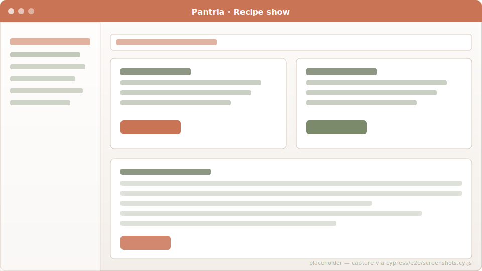
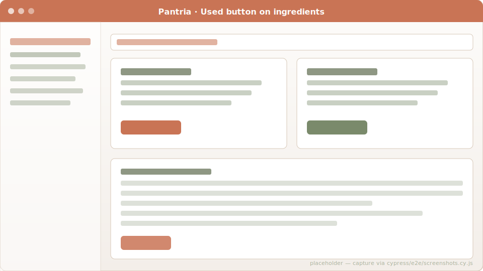
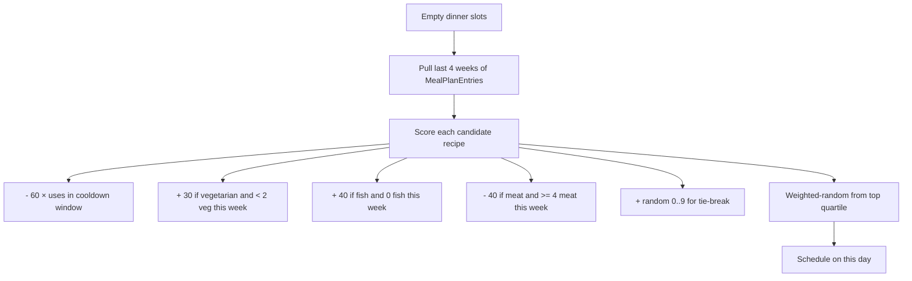

# Recipes & meal plan

Recipes link to your tracked Products as ingredients, so the same row
that says "200 g Mehl" is the same row that gets decremented when you
cook the recipe and is the same row offer-matched on your grocery list.

## Import from Chefkoch

Paste any `https://www.chefkoch.de/rezepte/<id>/...` URL into the
"Import" form on `/recipes`. Homestead pulls the recipe via Chefkoch's
public JSON API at `api.chefkoch.de/v2/recipes/<id>`, creates a Recipe
row, and turns each ingredient into a `RecipeIngredient` row:

- Ingredient names match against existing household Products
  (case-insensitive); missing products are created on the fly with the
  Chefkoch-reported unit (g/kg/ml/l mapped to canonical Homestead units,
  anything else falls back to `pcs`).
- The Chefkoch unit ("EL", "TL", "Prise(n)") is preserved as the
  per-row unit override so the display still reads "4 EL Öl".
- Chefkoch's `usageInfo` ("lauwarm", "nach Geschmack") lands in the row
  `notes`.
- Tags become the recipe's `tag_list` — driving the suggester (see below).
- "Salz nach Geschmack" rows (amount `0` on Chefkoch's side) fall back
  to quantity 1 so the row imports cleanly without tripping the
  `quantity > 0` validation.

## "Used" decrements storage

Each recipe ingredient row has a "Used" button. Clicking it walks the
household's StorageItems for that Product in expires-on-soonest order,
draining quantity until either the recipe demand is met or you run out.
Drops storage rows that hit zero. Returns a `ConsumeResult` with how
much was consumed and how much you came up short.

Refuses the conversion when the row's unit override doesn't match the
Product's storage unit ("4 EL Öl" against an oil row stored in ml has
no defensible auto-conversion), and surfaces a "unit mismatch" flash
instead of silently corrupting the inventory.

## "Add missing to grocery list"

One bulk action on the recipe show page: for every ingredient whose
on-hand < required quantity (and whose unit matches the product's),
add the *deficit* (not the full recipe amount) to the household's
grocery list. Existing "needed" rows get their quantity bumped instead
of duplicated. Skips unit-mismatched rows and reports them separately.

## Meal plan grid

`/meal_plan` shows the Mon–Sun grid for whatever week contains today
(navigate via `?date=YYYY-MM-DD`). Each cell is a day × slot
(breakfast / lunch / dinner / snack); click to add an entry from your
recipe list.

## Weekly meal-plan suggester

The "Suggest week" button fills the empty dinner slots automatically:

Health buckets follow DGE-aligned soft targets: ≥ 2 vegetarian
(`vegetarisch`/`vegan`) per week, ≥ 1 fish (`fisch`/`fish`), ≤ 4 meat
(`fleisch`/`rind`/`hähnchen`/…). When recipe tags are missing the
buckets silently degrade to "any recipe is fine". When the household
has fewer recipes than open slots, the suggester stops rather than
repeat.

## Code references

- Recipe model: [`app/models/recipe.rb`](https://github.com/SGraef/Homestead/blob/main/app/models/recipe.rb)
- Ingredient consume: [`app/models/recipe_ingredient.rb`](https://github.com/SGraef/Homestead/blob/main/app/models/recipe_ingredient.rb)
- Chefkoch importer: [`app/services/chefkoch/importer.rb`](https://github.com/SGraef/Homestead/blob/main/app/services/chefkoch/importer.rb)
- Meal plan suggester: [`app/services/meal_plan_suggester.rb`](https://github.com/SGraef/Homestead/blob/main/app/services/meal_plan_suggester.rb)
