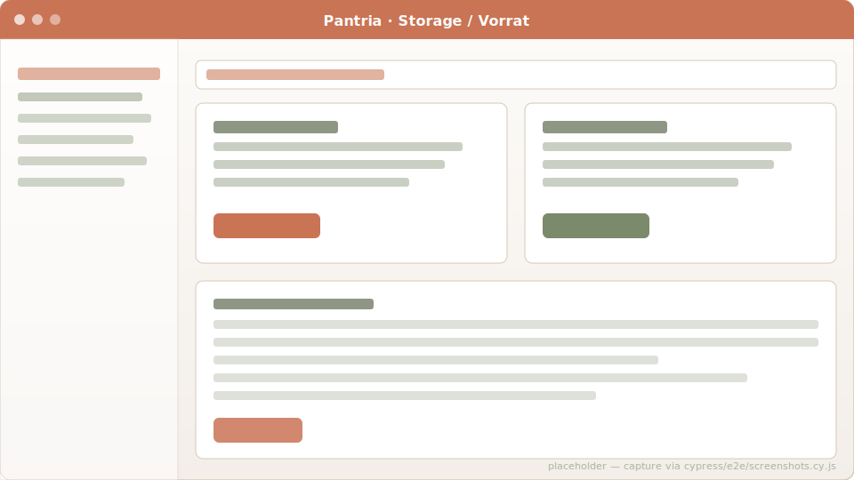
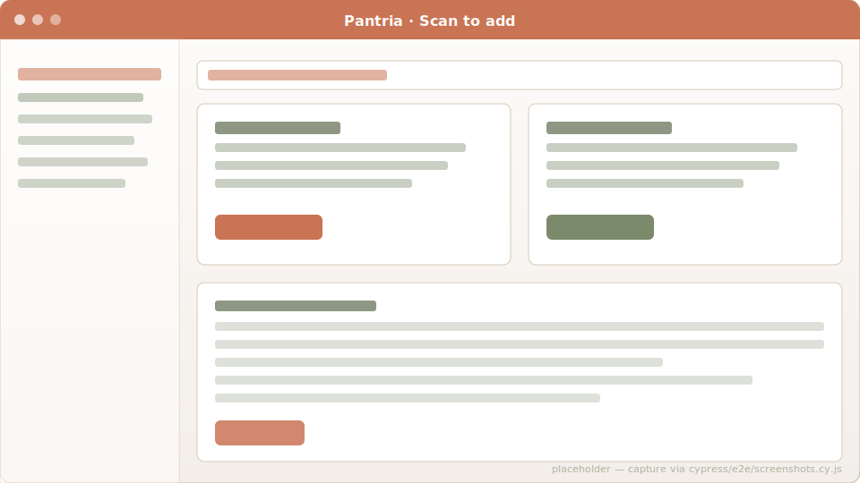

# Storage

The pantry, fridge, freezer, cellar — anywhere food lives. Homestead tracks
*what* you have, *how much*, *where* it's kept, and *when it expires*.

## Locations are first-class

Out of the box every household gets `pantry`, `fridge`, `freezer` and
`cellar` rows. Add your own ("Garagen-Tiefkühltruhe", "Vorratsraum 2",
"Bürokühlschrank") from `/locations`. Each Location has a `kind`
("pantry" / "fridge" / "freezer" / "other") that drives behaviour:

- **Freezer** rows auto-stamp `frozen_on` so the dashboard can flag
  items that have been frozen longer than `FREEZER_STALE_DAYS` (default
  90).
- **Fridge** rows are the default for receipts marked "to storage" with
  no explicit location.

## The freezer view

`/freezer` is a dedicated sub-page for cold-stored items. Shows both
bought-and-frozen items and homemade meals (grams / portions /
litres), plus a 3-month "stale" warning chip per row.

## Add by barcode

Scanning a barcode on the storage index opens an inline kiosk page at
`/storage_items/scan`. The camera stays on; every detected EAN POSTs to
`scan_add` and lands a row in the on-page Turbo Stream log. A 2.5 s
per-barcode debounce keeps you from adding the same package 20 times
while you're aiming.

Resolution uses `Product.by_barcode` so both the primary EAN AND
registered alternate `ProductBarcode` rows hit. Unknown barcodes return
a warning row with a "Create product for this code" deep link — you can
fix it without leaving the page.

## "I used N of these"

Each storage row has an inline `Quantity` + `−` form. Default is 1 (so
a single click still mirrors the old "−1" behaviour) but you can edit
the amount first — `0,5` for half a litre of milk, `2` for two eggs,
comma decimals accepted (German keyboard). When the result hits zero,
the row is destroyed.

## Move items

Inline form on each row: pick the target location, type the quantity
(defaults to full), submit. If the target already has a row for the
same product, quantities merge and earlier expiry / frozen-on wins.
Source row is decremented or destroyed.

## Dashboard widgets

The home dashboard surfaces two storage-derived alerts:

- **Expiring soon** — items whose `expires_on` is within the next 7
  days.
- **Stale in freezer** — freezer rows whose `frozen_on` (or
  `created_at`) is older than `FREEZER_STALE_DAYS`.

## Code references

- Model: [`app/models/storage_item.rb`](https://github.com/SGraef/Homestead/blob/main/app/models/storage_item.rb)
- Controller: [`app/controllers/storage_items_controller.rb`](https://github.com/SGraef/Homestead/blob/main/app/controllers/storage_items_controller.rb)
- Scan kiosk Stimulus controller: [`app/javascript/controllers/storage_kiosk_controller.js`](https://github.com/SGraef/Homestead/blob/main/app/javascript/controllers/storage_kiosk_controller.js)
