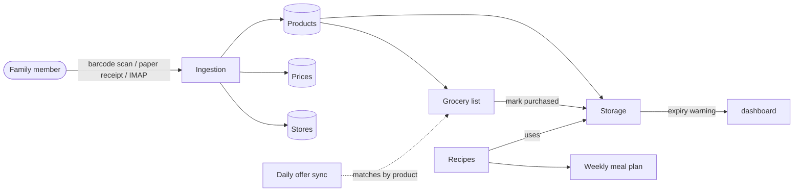

# Pantria

  <em>Household ERP focused on food storage, multi-store grocery price tracking,
  and barcode-driven inventory updates. German-first UI with English fallback,
  REST API for mobile / automation clients, and an OCR pipeline that turns
  supermarket receipts into structured products, stores and prices.</em>

!!! warning "Heads-up: this app is vibe-coded"
    Pantria was built largely through pair-programming with an LLM rather than
    hand-rolled line by line. The test suite is reasonably thorough and the
    code follows Rails conventions, but you should treat it the way you'd
    treat any vendored library you didn't write:

    - **Read before you deploy.** Skim the controllers, the OCR pipeline,
      the inbound-email poller and the offer adapters before pointing them
      at anything you care about.
    - **Backups are on you.** There's no battle-tested upgrade story.
      Snapshot the database and the Active Storage directory before
      pulling a new image.
    - **Issues / PRs welcome,** but expect the same human + LLM workflow on
      the response side.

## What it does

-   :material-package-variant-closed:{ .lg .middle } **Track what's in stock**

    ---

    Pantry, fridge, freezer, cellar, custom locations. Expiry warnings,
    barcode-driven quick-add, "scan & add to storage" kiosk page for
    bulk unloading groceries.

    [:octicons-arrow-right-24: Storage](features/storage.md)

-   :material-cart:{ .lg .middle } **Manage the shopping list**

    ---

    Freeform shopping list entries or linked to tracked products. Bring!
    two-way sync. Mark-as-bought-by-barcode-scan at the till.

    [:octicons-arrow-right-24: Grocery list](features/grocery-list.md)

-   :material-receipt-text-outline:{ .lg .middle } **Scan paper receipts**

    ---

    Upload a JPEG / PNG / HEIC / PDF, Tesseract + a heuristic parser turn
    it into Stores + Products + Prices. Inbound IMAP polling means
    e-receipts arrive automatically.

    [:octicons-arrow-right-24: Receipt OCR](features/receipts.md)

-   :material-tag-multiple-outline:{ .lg .middle } **Compare prices**

    ---

    Every Price is `(product, store, date, pack_quantity)` in cents so a
    €2.49 / 500 g pack renders as €4.98 / kg. Daily offer feed from
    Marktguru / kaufDA / MeinProspekt / Flaschenpost.

    [:octicons-arrow-right-24: Offers](features/offers.md)

-   :material-chef-hat:{ .lg .middle } **Cook from what you have**

    ---

    Import recipes from Chefkoch by URL, "used" button on ingredients
    decrements storage, weekly meal-plan suggester with soft DGE-aligned
    health guidelines and 4-week cooldown.

    [:octicons-arrow-right-24: Recipes & meal plan](features/recipes.md)

-   :material-cellphone-link:{ .lg .middle } **Use it like a native app**

    ---

    Installable PWA on iOS and Android. Trusted Web Activity APK for the
    Play Store. Native `BarcodeDetector` scanner with a vendored ZXing
    fallback for Safari.

    [:octicons-arrow-right-24: PWA & Android](pwa-android.md)

-   :material-checkbox-marked-outline:{ .lg .middle } **Plan together**

    ---

    Shared todos with states, assignment, follows, comments and PWA push
    notifications. An in-app calendar that projects todo due-dates and
    two-way-syncs with Google Calendar.

    [:octicons-arrow-right-24: Todos](features/todos.md) ·
    [Calendar](features/calendar.md)

## At a glance

## License

[MIT](https://github.com/SGraef/Pantria/blob/main/LICENSE). Use it, fork it,
ship it. PRs welcome.
