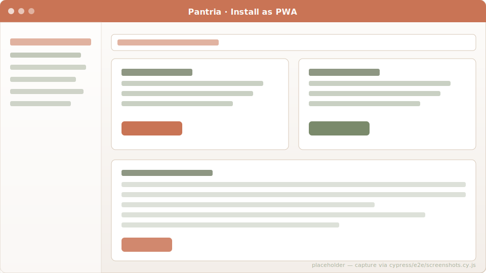

# PWA & Android

Homestead works as a real installable PWA on any modern browser, and ships
with an Android wrapper APK (a Trusted Web Activity) that drops the
Chrome URL bar and looks indistinguishable from a native app.



## PWA

Out of the box at `/manifest.json` and `/service-worker.js`:

- **Manifest**: full Web App Manifest with theme color, app shortcuts
  (Scan / Grocery list / Storage) for Android's long-press menu, and
  PNG + maskable icons.
- **Service worker**: network-first for HTML navigations (falls back to
  the offline page at `/offline` when the network is unreachable),
  cache-first for static assets, pass-through for everything else. The
  `vendor/javascript/@zxing--*.js` files are caught by the cache-first
  rule so the iOS barcode scanner works offline after first load. It also
  carries `push` and `notificationclick` handlers for Web Push (see below).
- **Layout meta tags**: `<link rel="manifest">`, `apple-touch-icon`,
  `apple-mobile-web-app-capable`, theme-color.

To install:

- **Chrome / Edge desktop**: install icon in the address bar.
- **Android Chrome**: ⋮ menu → "Install app" or "Add to Home Screen".
- **iOS Safari**: Share → "Add to Home Screen".

Once installed it opens in `display: standalone` mode — no browser
chrome, dedicated icon in the launcher, deep-link handling for
`https://your-host/...` URLs.

## Android (TWA)

The `android/` directory in the repo holds a complete Gradle project
that wraps the PWA in a [Trusted Web Activity](https://developer.chrome.com/docs/android/trusted-web-activity).
No native code, no separate JSON API, builds in ~30 seconds.

### Prerequisites

- JDK 17+
- Android command-line tools (or full Android Studio)
- PWA reachable at **HTTPS** (Chrome refuses TWA verification on plain HTTP)

### Build

```bash
cd android
gradle wrapper --gradle-version 8.10.2          # one-time
./gradlew assembleDebug -PpantriaHost=pantria.your-domain.tld
adb install -r app/build/outputs/apk/debug/app-debug.apk
```

### Hide the URL bar

The TWA shows the Chrome URL bar until it verifies that the APK signing
key matches a fingerprint listed in your domain's
`/.well-known/assetlinks.json`. Homestead serves that file dynamically
from `WellKnownController`:

```bash
# Capture the debug keystore's SHA-256
keytool -list -v -keystore ~/.android/debug.keystore \
        -alias androiddebugkey -storepass android -keypass android \
    | grep 'SHA256:'

# Set on Homestead's environment (.env / Unraid template / docker-compose):
#   ANDROID_TWA_PACKAGE=de.lunawolf.pantria
#   ANDROID_TWA_FINGERPRINTS=AA:BB:CC:...
```

Restart Rails, reinstall the APK — the URL bar should be gone.

### Production signing

Before publishing to Play Store, create a real keystore, swap
`signingConfig` in `android/app/build.gradle.kts`, and **append** the
release cert's SHA-256 to `ANDROID_TWA_FINGERPRINTS` (it's a
comma-separated list so debug + release coexist during rollout). Build
an App Bundle:

```bash
./gradlew bundleRelease
# upload app/build/outputs/bundle/release/app-release.aab to Play Console
```

Detailed walkthrough including camera permission semantics:
[`android/README.md`](https://github.com/SGraef/Homestead/blob/main/android/README.md).

## What's *not* in there

- **No JSON API frontend.** The TWA renders the same Hotwire HTML the
  browser does. Want native Kotlin views? That's a different project.
- **No real offline editing.** The service worker handles "page is
  cached when network is down"; real offline state + sync would need a
  client-side store. Out of scope.

## Push notifications

Homestead ships a full Web Push stack used by the
[Todos](features/todos.md#notifications-push) feature — assignment and
followed-change notifications arrive as native notifications on an installed
PWA, and tapping one deep-links to the todo.

- Generate a VAPID keypair and set `VAPID_PUBLIC_KEY`, `VAPID_PRIVATE_KEY` and
  `VAPID_SUBJECT=mailto:you@example.com` in the environment. Rotating the keypair
  invalidates every existing subscription (members must re-subscribe).
- Members opt in with an explicit tap; the service worker's `push` /
  `notificationclick` handlers render and route the notification.
- Web Push needs an **installed** PWA on iOS (16.4+); where push is unavailable,
  notifications still appear in the in-app bell.
